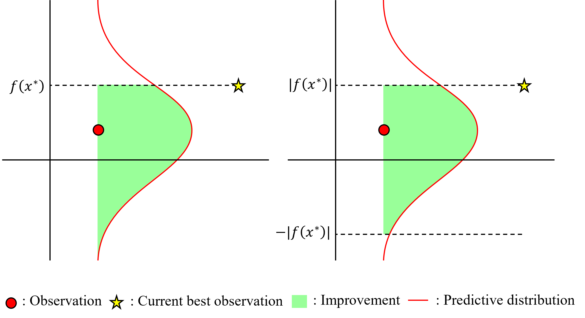
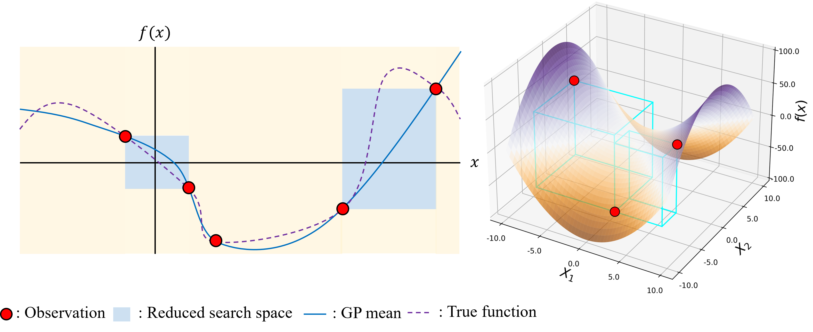

# **Bayesian Optimization with Root-Finding (BOwRF)**

## Introduction
Bayesian Optimization (BO) is a prominent tool for finding the optimum of the expensive-to-evaluate function. In this repository, we provide a root-finding scheme adapted BO that is particularly useful when calibrating the virtual model (digital twin) to their real-world counterparts. Posted codes and figures are based on the paper that will be published in the Winter Simulation Conference (WSC 2024).

Y, Jeon., S. Shashaani,  2024. “CALIBRATING DIGITAL TWINS VIA BAYESIAN OPTIMIZATION WITH A ROOT FINDING STRATEGY”. In 2024 Winter Simulation Conference (WSC)

## Modified acquisition function
BOwRF requires modified acquisition functions, where we denote subscript "RF" to distinguish them from the traditional acquisition functions (within the minimization setting).

| Acquisition function | Closed-form expression |
|-----------------|-----------------|
| $\text{UCB}(\theta)$    | $\mu(\theta) + \lambda \sigma(\theta)$   |
| $\text{UCB}_{\text{RF}}(\theta)$    | $\|\mu(\theta)\| + \lambda \sigma(\theta)$   |
| $\text{PI}(\theta)$    | $\Phi\left(\frac{f(\theta ^ *) - \mu(\theta)}{\sigma(\theta)}\right)$  |
| $\text{PI}_{\text{RF}}(\theta)$    | $\Phi\left(\frac{\|f(\theta ^ *)\| - \mu(\theta)}{\sigma(\theta)}\right) - \Phi\left(\frac{-\|f(\theta ^ *)\| - \mu(\theta)}{\sigma(\theta)}\right)$  |
| $\text{EI}(\theta)$    | $(f(\theta ^ *) - \mu(\theta))\Phi\left(\frac{f(\theta ^ *) - \mu(\theta)}{\sigma(\theta)}\right) + \sigma(\theta)\phi\left(\frac{f(\theta ^ *) - \mu(\theta)}{\sigma(\theta)}\right)$  |
| $\text{EI}_{\text{RF}}(\theta)$    | $\|f(\theta ^ *)\|\left(\Phi\left(\frac{\|f(\theta ^ *)\| - \mu(\theta)}{\sigma(\theta)}\right) - \Phi\left(\frac{-\|f(\theta ^ *)\| - \mu(\theta)}{\sigma(\theta)}\right)\right) + \mu(\theta) \left(2\Phi\left(\frac{- \mu(\theta)}{\sigma(\theta)}\right)  - \Phi\left(\frac{\|f(\theta ^ *)\| - \mu(\theta)}{\sigma(\theta)}\right) - \Phi\left(\frac{-\|f(\theta ^ *)\| - \mu(\theta)}{\sigma(\theta)}\right) \right) + \sigma(\theta) \left(2\phi\left(\frac{- \mu(\theta)}{\sigma(\theta)}\right)  - \phi\left(\frac{\|f(\theta ^ *)\| - \mu(\theta)}{\sigma(\theta)}\right) - \phi\left(\frac{-\|f(\theta ^ *)\| - \mu(\theta)}{\sigma(\theta)}\right)  \right) $  |

Note: While in the paper, we have used $\|f(\theta ^ *)\|$ instead of $f(\theta ^ *)$ in the context of calibration task, we instead post a general form in this case.



This figure illustrates the ditinctive definition of PI in the minimization (left) and root-finding (right).

## Bounding the search space
Based on the Bolzano's theorem, we have implemented the search space reduction technique, namely RSS in the code. The crux of this technique is to force the optimization process to focus on the selected regions where the root is ensured. RSS is devised to return a single promising region, which is computed based on the smallest hypervolume. But still, one may consider using multiple regions particularly in the case of complex kernel such as Matern kernel.



## Implementation note
When running the attached notebook file, in case of running this via computational resource limited environment (e.g., basic setting Google Colab) or where the number of cores in CPU is limited, avoid utilizing parallel setting. Hence, we recommend change the command line in the **Parallel setup**, using the for-loop:

```
results = [single_minimization_attempt(x0, acquisition, model, bounds) for x0 in x0s] 
